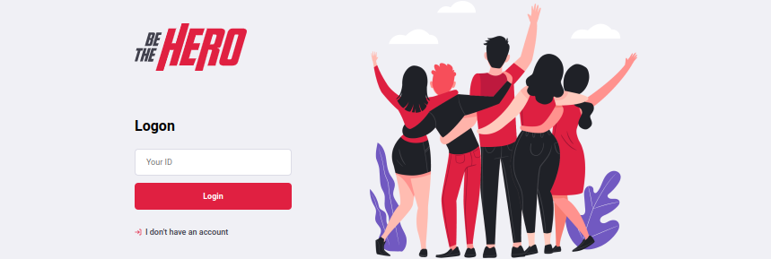

<div align="center" style="margin-bottom: 20px;">

</div>

<div align="center" style="margin: 20px;">

</div>

## :smile: The Project

This is an application for Non governamental organizations that help abandoned animals, with this app,
they can create a form with detailed description and the cost about the situation they need help with, and then, a Hero can come and Help the cause.

## :fire: About the Application

### :sunglasses: Live Demo

A live demo of the application is available <a href="https://rodrigogdev-be-the-hero.herokuapp.com/">HERE</a>


### :rocket: Used Technologies

Some of the technologies used in this project are:

- [NodeJS](https://nodejs.org/en/)
- [ReactJS](https://pt-br.reactjs.org/)
- [ExpressJS](https://expressjs.com/pt-br/)
{...}

## :zap: Running the Project
#### Clone Repository
```sh
$ git clone https://github.com/rodrigogdev/Be-The-Hero.git
$ cd Be-The-Hero
```
#### Starting the API
```sh
$ cd backend

# Run npm install to build node_modules and run the API application
$ npm install && npm run start
```

#### Starting the web
```sh
$ cd web
$ npm install && npm start
```

<p align="center" style="margin-top: 20px; border-top: 1px solid #eee; padding-top: 20px;">Made with :purple_heart: by <strong> Rodrigo Gonçalves</strong> </p>